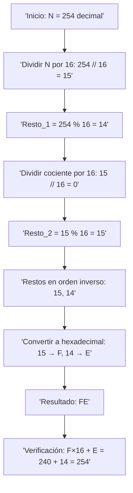
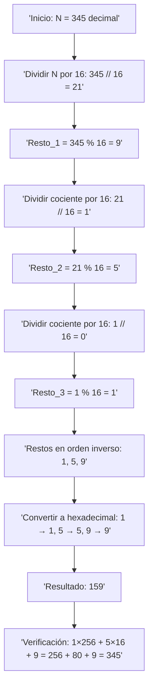

# Conversión de un número decimal N a hexadecimal (base 16)

#### Ejemplo: N = 254:




1. Prepara el número:

   N = 254

 2. Divide N por 16 para obtener el cociente y el resto:
 
   cociente_1 = N // 16        -> 254 // 16 = 15
   resto_1    = N % 16         -> 254 % 16 = 14

 3. Vuelve a dividir el cociente por 16 hasta que sea 0:
   cociente_2 = 15 // 16 = 0
   resto_2    = 15 % 16 = 15

 4. Toma los restos en orden inverso (del último al primero):
 restos = [resto_2, resto_1] = [15, 14]

1.  Convierte cada resto a su dígito hexadecimal:
   0–9  -> '0'...'9'
   10   -> 'A'
   11   -> 'B'
   12   -> 'C'   13   -> 'D'  
   14   -> 'E'   15   -> 'F'   Entonces: 15 -> 'F', 14 -> 'E'

 2. Une los dígitos:    "F" + "E" = "FE"

 3. Verifica: FE_16 = F*16 + E*1 = 15*16 + 14 = 240 + 14 = 254
  Correcto: 254_10 = FE_16

```js
function decimalAHexConPasos(n) {
  console.log(`# Conversión de ${n} (base 10) a hexadecimal (base 16)`);

  if (n === 0) {
    console.log("0 en decimal es 0 en hexadecimal.");
    return "0";
  }

  const pasos = [];
  let cociente = n;

  // División sucesiva
  while (cociente > 0) {
    const nuevoCociente = Math.floor(cociente / 16);
    const resto = cociente % 16;
    pasos.push({ cociente, nuevoCociente, resto });
    console.log(`${cociente} ÷ 16 = ${nuevoCociente} con resto ${resto}`);
    cociente = nuevoCociente;
  }

  // Mapeo de valores hexadecimales
  const mapaHex = "0123456789ABCDEF";
  const restos = pasos.map(p => p.resto).reverse();
  const digitosHex = restos.map(r => mapaHex[r]);
  const resultado = digitosHex.join("");

  console.log("\n# Restos en orden inverso:", restos);
  console.log("# Dígitos hex correspondientes:", digitosHex);
  console.log(`# Resultado final: ${n}_10 = ${resultado}_16`);

  // Verificación
  let verificacion = 0;
  for (let i = 0; i < digitosHex.length; i++) {
    const potencia = digitosHex.length - 1 - i;
    const valor = mapaHex.indexOf(digitosHex[i]);
    const aporte = valor * Math.pow(16, potencia);
    console.log(`Verificación: ${digitosHex[i]} × 16^${potencia} = ${valor} × ${Math.pow(16, potencia)} = ${aporte}`);
    verificacion += aporte;
  }

  console.log(`Suma total = ${verificacion} (debe ser ${n})`);
  return resultado;
}

// Ejemplo de uso:
const resultadoHex = decimalAHexConPasos(254);
console.log("Hex final:", resultadoHex);

```

 OTRO EJEMPLO:

#### Conversión de 345 (decimal) a hexadecimal (base 16)



 Fórmula general:
 N = d_n * 16^n + d_(n-1)*16^(n-1) + ... + d_1  16^1 + d_0 * 16^0

 Paso 1: dividir 345 entre 16
 345 ÷ 16 = 21 con resto 9
 -> d0 = 9

 Paso 2: dividir el cociente (21) entre 16
 21 ÷ 16 = 1 con resto 5
 -> d1 = 5

 Paso 3: dividir el cociente (1) entre 16
 1 ÷ 16 = 0 con resto 1
 -> d2 = 1

 Restos en orden inverso: [1, 5, 9]
 Dígitos hexadecimales: 1, 5, 9
 Resultado: 345_10 = 159_16

 Verificación con la fórmula:
 159_16 = (1*16^2) + (5*16^1) + (9*16^0)
 = (1 * 256) + (5*16) + (9* 1) = 256 + 80 + 9
 = 345

