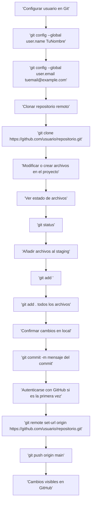

# guia de inicio de sistemas informaticos

## Unidade 1

[Unidade 1](/UD01/introduccion.md)

## Unidade 2

[Unidade 2](/UD02/harwdware.md)
<br>

[Unidade 2 Conversiones](/UD02/conversiones.md)

## Unidade 3
 
```js
let x = 0;
let y= 2;
let z= x +y; // Total 2

```

#### Cuando usar git push origin main?


* Después de hacer un commit en local Cada vez que confirmas cambios con git commit -m "mensaje", esos cambios solo están en tu repositorio local. Para que aparezcan en GitHub, necesitas hacer git push origin main.

* Cuando tu rama local está adelantada respecto al remoto Si git log muestra commits en HEAD -> main que no están en origin/main, significa que aún no los has subido. Ahí es cuando debes hacer el push.

* Al iniciar un proyecto nuevo Una vez que configuras el remoto (git remote add origin **URL** o git remote set-url origin **URL>**), el primer git push origin main sube todo tu historial al repositorio en GitHub.